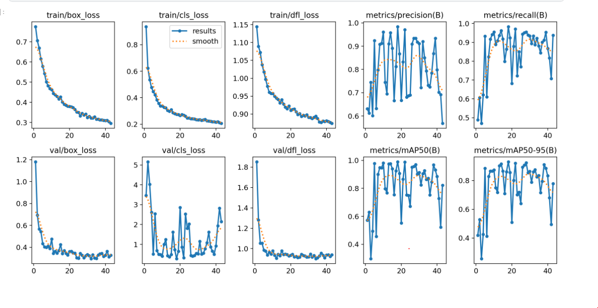

Face Anti-Spoofing using YOLO11m (Transfer Learning)

This project builds a real-time face anti-spoofing system to detect if a face in the camera is real/live or spoof/fake (e.g., face displayed from a phone screen).

The model is trained using YOLO11m with transfer learning on a custom webcam collected dataset.

📌 Dataset

Custom data was collected using a laptop webcam.

Split	Persons Used	Description
Train (70%)	2 people	Real face + Spoof (from phone screen)
Validation (20%)	1 person	unseen identity
Test (10%)	1 person	unseen identity

This split ensures the model generalizes across identities (not memorizing faces).

📌 Model

Base model: yolo11m.pt

Task: Binary classification → Real vs Spoof

Approach: Transfer learning (fine-tuning last layers)

📈 Training Graphs

Below are the training & validation curves including loss, precision, recall, mAP50, mAP50-95:

✅ Results Summary

Model converges well (loss decreasing)

High Precision & Recall on validation

Good generalization to unseen identity in validation & test

🧠 Why YOLO11 for Anti-Spoof?

YOLO feature maps capture:

Skin texture

Reflective pattern on screens (spoof)

Sharp edges / pixel noise on phone display

These differences make YOLO embeddings a good base for anti-spoof detection.